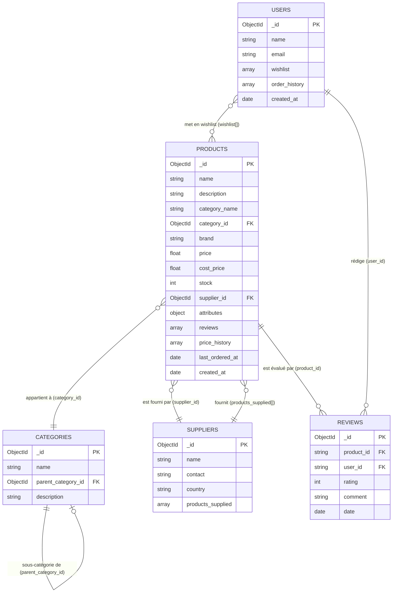

# Diagramme Entité-Relation – Product Catalog Management System

Ce document décrit la structure des 5 collections MongoDB et leurs relations par référence.

## erDiagram

---

## Description des collections

### `products`
Collection principale. Chaque document représente un produit du catalogue.

| Champ | Type | Description |
|---|---|---|
| `_id` | ObjectId | Identifiant unique MongoDB |
| `name` | string | Nom du produit |
| `description` | string | Description détaillée |
| `category_name` | string | Dénormalisation du nom de catégorie |
| `category_id` | ObjectId | Référence vers `categories._id` |
| `brand` | string | Marque |
| `price` | float | Prix de vente TTC |
| `cost_price` | float | Prix d'achat |
| `stock` | int | Quantité disponible en stock |
| `supplier_id` | ObjectId | Référence vers `suppliers._id` |
| `attributes` | object | Attributs variables (couleur, taille, etc.) |
| `reviews` | array | Avis embarqués `{rating, comment}` |
| `price_history` | array | Historique des prix `{price, date}` |
| `last_ordered_at` | date | Date de dernière commande |
| `created_at` | date | Date de création du document |

### `categories`
Référentiel des catégories produits, avec support de hiérarchie.

| Champ | Type | Description |
|---|---|---|
| `_id` | ObjectId | Identifiant unique |
| `name` | string | Nom de la catégorie |
| `parent_category_id` | ObjectId | Référence vers la catégorie parente (null si racine) |
| `description` | string | Description de la catégorie |

### `suppliers`
Référentiel des fournisseurs.

| Champ | Type | Description |
|---|---|---|
| `_id` | ObjectId | Identifiant unique |
| `name` | string | Raison sociale |
| `contact` | string | Email de contact |
| `country` | string | Pays d'origine |
| `products_supplied` | array | Liste de `products._id` (strings) fournis |

### `reviews`
Avis utilisateurs indépendants (liés par référence, en plus des avis embarqués dans `products.reviews`).

| Champ | Type | Description |
|---|---|---|
| `_id` | ObjectId | Identifiant unique |
| `product_id` | string | Référence vers `products._id` |
| `user_id` | string | Référence vers `users._id` |
| `rating` | int | Note de 1 à 5 |
| `comment` | string | Commentaire (peut être vide) |
| `date` | date | Date de l'avis |

### `users`
Profils utilisateurs avec liste de souhaits.

| Champ | Type | Description |
|---|---|---|
| `_id` | ObjectId | Identifiant unique |
| `name` | string | Nom complet |
| `email` | string | Adresse email |
| `wishlist` | array | Liste de `products._id` (strings) |
| `order_history` | array | Historique des commandes |
| `created_at` | date | Date de création du compte |

---

## Notes sur les choix de modélisation MongoDB

- **Avis dénormalisés** : les avis sont stockés à la fois en tableau embarqué dans `products.reviews` (accès rapide sans jointure) et dans la collection `reviews` indépendante (pour les agrégations cross-produit et la détection d'avis suspects).
- **Référencement par string** : `reviews.product_id`, `users.wishlist[]` et `suppliers.products_supplied[]` stockent les ObjectId sous forme de chaînes pour faciliter les requêtes depuis le frontend sans conversion.
- **Dénormalisation `category_name`** : le champ `category_name` est dupliqué dans chaque produit pour éviter les jointures ($lookup) sur les requêtes de liste.
- **`price_history` embarqué** : l'historique de prix est un tableau embarqué dans le produit car il est toujours consulté avec le produit et ne dépasse pas quelques dizaines d'entrées.
